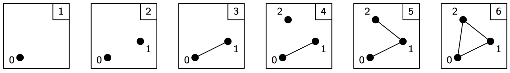
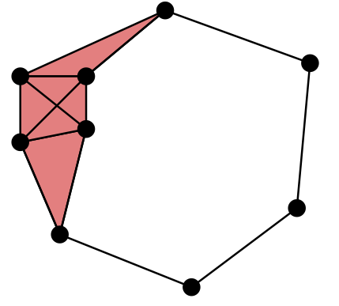

Practical Guide to Persistent Homology
======================================

First, we import everything from Dionysus:

.. doctest::

    >>> from __future__ import print_function   # if you are using Python 2
    >>> from dionysus import *

.. todo::

    Explain where to get the sample data from.

Simplices
---------

.. doctest::

    >>> s = Simplex([0,1,2])
    >>> print("Dimension:", s.dimension())
    Dimension: 2

We can iterate over the vertices of the simplex.

.. doctest::

    >>> for v in s:
    ...     print(v)
    0
    1
    2

Or over the boundary:

.. doctest::

    >>> for sb in s.boundary():
    ...     print(sb)
    <1,2> 0
    <0,2> 0
    <0,1> 0

Simplices can store optional data, and the 0 reported after each boundary edge is the default value of the data.

We can use :func:`~dionysus.closure` to generate all faces of a set of
simplices. For example, an 8-sphere is the 8-dimensional skeleton of the
closure of the 9-simplex.

.. doctest::

    >>> simplex9 = Simplex([0,1,2,3,4,5,6,7,8,9])
    >>> sphere8  = closure([simplex9], 8)
    >>> print(len(sphere8))
    1022

Filtration
----------

A filtration is a nested sequence of simplicial complexes,
:math:`K_1 \subseteq K_2 \subseteq \ldots \subseteq K_n`.
Without loss of generality, we can assume that
two consecutive filtrations differ by a single simplex, so we can think of
a filtration as a sequence of simplices.

In Dionysus, a filtration is represented by a special class
:class:`~dionysus._dionysus.Filtration` that supports both iterating over the
simplices and looking up an index given a simplex. A filtration can be
:meth:`~dionysus._dionysus.Filtration.sort`\ ed. By default this orders
simplices by their data, breaking ties by dimension, and then
lexicographically.

.. doctest::

    >>> simplices = [([2], 4), ([1,2], 5), ([0,2], 6),
    ...              ([0], 1),   ([1], 2), ([0,1], 3)]
    >>> f = Filtration()
    >>> for vertices, time in simplices:
    ...     f.append(Simplex(vertices, time))
    >>> f.sort()
    >>> for s in f:
    ...    print(s)
    <0> 1
    <1> 2
    <0,1> 3
    <2> 4
    <1,2> 5
    <0,2> 6

We can lookup the index of a given simplex. (Indexing starts from 0.)

.. doctest::

    >>> print(f.index(Simplex([1,2])))
    4

Homology
--------

Dionysus doesn’t compute homology directly, but we can get it as a by-product
of persistent homology.

::

    >>> f = Filtration(sphere8)
    >>> f.sort()
    >>> p = persistence(f, p=2)
    >>> dgms = init_diagrams(p, f)
    >>> for i, dgm in enumerate(dgms):
    >>>     print("Dimension:", i)
    >>>     print(dgm)
    Dimension: 0
    0 inf
    Dimension: 1
    Dimension: 2
    Dimension: 3
    Dimension: 4
    Dimension: 5
    Dimension: 6
    Dimension: 7
    Dimension: 8
    0 inf

Persistent Homology
-------------------

::

    >>> p = fast_persistence(f, p=2)
    >>> p = fast_persistence(f, p=2)
    >>> p = fast_persistence(f, p=2)

Alpha shapes
------------

.. image:: figures/alpha-shape.png
   :scale: 50 %
   :align: center

::

    >>> points = read_points('data/trefoil.pts')
    >>> f = alpha_complex(points)
    >>> print("Filtration size:", len(f))

::

    >>> show_complex(points, [s for s in f if s.data < 1])

Vietoris--Rips Complexes
------------------------

.. testsetup::

   import numpy as np
   np.random.seed(0)

.. doctest::
   :options: +ELLIPSIS

   >>> import numpy as np
   >>> points = np.random.random((100,2))
   >>> f = fill_rips(points, 2, .3)
   >>> print(f)
   Filtration with 5974 simplices
   >>> for s in f:
   ...     print(s)
   <0> 0
   ...
   <9,61,92> 0.0899135
   <9,72,92> 0.0899135
   <9,82,92> 0.0899135

:func:`~dionysus._dionysus.fill_rips` also accepts `condensed distance matrices <https://docs.scipy.org/doc/scipy-0.18.1/reference/spatial.distance.html>`_
(linearized lower triangular part of a symmetric matrix):

.. doctest::

   >>> from scipy.spatial.distance import pdist
   >>> dists = pdist(points)
   >>> f = fill_rips(dists, 2, .3)
   >>> print(f)
   Filtration with 5974 simplices

Lower-star Filtrations
----------------------

.. image:: figures/lower-star.png
   :scale: 50 %
   :align: center

