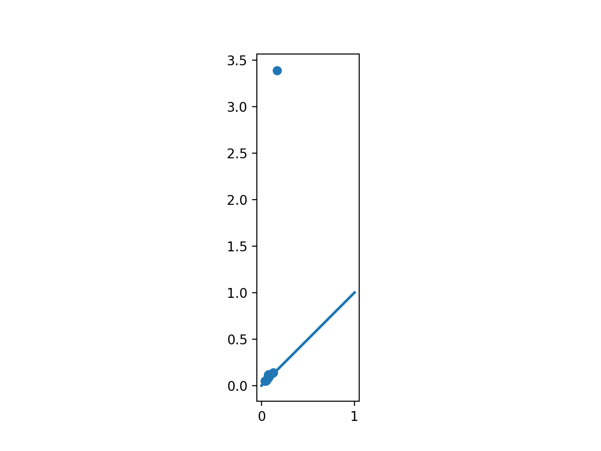
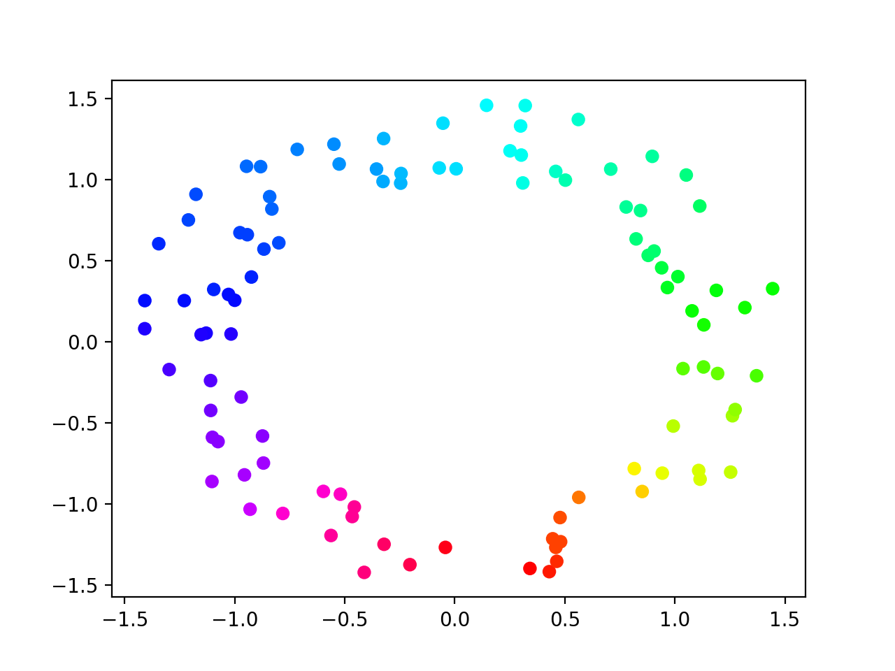

Cohomology Persistence
----------------------

.. testsetup::

    from __future__ import print_function   # if you are using Python 2
    from dionysus import *
    import numpy as np
    np.random.seed(0)

.. doctest::

    >>> simplices = [([2], 4), ([1,2], 5), ([0,2], 6),
    ...              ([0], 1),   ([1], 2), ([0,1], 3)]
    >>> f = Filtration()
    >>> for vertices, time in simplices:
    ...     f.append(Simplex(vertices, time))
    >>> f.sort()

Applying cohomology functor to the filtration, we get a sequence of cohomology groups, connected by linear maps:
:math:`H^*(K_1) \to H^*(K_2) \to \ldots \to H^*(K_n)`. To compute decomposition of this sequence, i.e., persistence barcode,
we use :func:`~dionysus._dionysus.cohomology_persistence`.

.. doctest::

    >>> p = cohomology_persistence(f, prime=2)

The returned object stores the persistence pairs as well as the cocycles still
alive at the end of the filtration (i.e., a basis for :math:`H^*(K_n)`). To
extract persistence diagrams, we use, as before,
:func:`~dionysus._dionysus.init_diagrams`:

.. doctest::

    >>> dgms = init_diagrams(p, f)
    >>> for i,dgm in enumerate(dgms):
    ...     print(i)
    ...     for pt in dgm:
    ...         print(pt)
    0
    (1,inf)
    (2,3)
    (4,5)
    1
    (6,inf)

To access the alive cocycles, we iterate over the returned object. For each
element, `index` stores the index in the filtration when the cocycle was born,
while `cocycle` stores the cocycle itself.

.. doctest::

    >>> for c in p:
    ...     print(c.index, c.cocycle)
    0 1*0 + 1*1 + 1*3
    5 1*5

Circular Coordinates
~~~~~~~~~~~~~~~~~~~~

Every 1-dimensional cocycle (over integer coefficients) corresponds to a map
from the space to a circle. `Persistent Cohomology and Circular Coordinates
<http://mrzv.org/publications/circular/>`_ outlines a methodology for computing
a map from a point set to a circle that represents a persistent cocycle in the
data. This section sketches an example of how to use Dionysus to compute such
a map.

As our sample, we generate 100 points on an annulus:

.. doctest::

    >>> points = np.random.normal(size = (100,2))
    >>> for i in range(points.shape[0]):
    ...     points[i] = points[i] / np.linalg.norm(points[i], ord=2) * np.random.uniform(1,1.5)

We construct the Vietoris--Rips filtration on the points and compute its
persistence diagrams, using coefficients in :math:`\mathbb{Z}_{11}`:

.. doctest::

    >>> prime = 11
    >>> f = fill_rips(points, 2, 2.)
    >>> p = cohomology_persistence(f, prime, True)
    >>> dgms = init_diagrams(p, f)

The 1-dimensional persistence diagram reflects that we've sampled an annulus::

    >>> import matplotlib.pyplot as plt
    >>> plt.scatter([pt.birth for pt in dgms[1]], [pt.death for pt in dgms[1]])
    >>> ...
    >>> plt.show()

We select the highest persistence point and take its corresponding cocycle:

.. doctest::

    >>> pt = max(dgms[1], key = lambda pt: pt.death - pt.birth)
    >>> print(pt)
    (0.164409,3.38459)

    >>> cocycle = p.cocycle(pt.data)

To smooth the cocycle and convert it to the corresponding circular coordinates,
we need to choose a complex, in which we do the smoothing. Here we select the
complex in the filtration that exists at the midvalue of the persistence bar, :code:`(pt.death + pt.birth)/2`:

.. doctest::

    >>> f = Filtration([s for s in f if s.data <= (pt.death + pt.birth)/2])
    >>> vertex_values = smooth(f, cocycle, prime)

Now we can plot the points using hue to show the circular coordinate::

    >>> plt.scatter(points[:,0], points[:,1], c = [vertex_values[x] for x in range(points.shape[0])], cmap = 'hsv')
    >>> plt.show()

