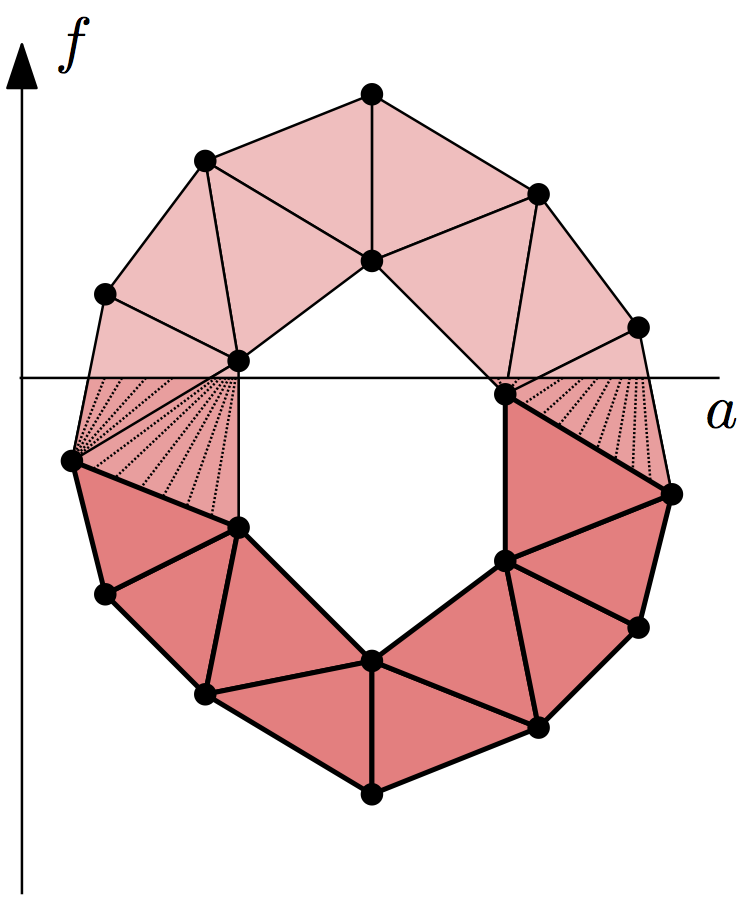

Lower-star Filtrations
----------------------

Given a simplicial complex :math:`K` and a real-valued function defined on its
vertices, :math:`f: \operatorname{Vrt} K \to \mathbb{R}`, we can extend it to
a continuous function by linear interpolation on the interiors of the
simplices. Suppose we want to compute persistent homology of the sublevel sets
of this function, :math:`|K|_a = f^{-1}(-\infty, a]`. Its persistence diagrams
are the same as for the lower-star filtration of simplicial complexes,
:math:`K_a = \{ \sigma \in K \mid \max_{v \in \sigma} f(v) \leq a \}`.
(It's easy to verify that the inclusion :math:`K_a \subseteq |K|_a` is a homotopy equivalence.)

So given such a function :math:`f`, it suffices to assign to each simplex of
:math:`K` the value of its maximum vertex. Sorting the resulting filtration
creates the lower-star filtration. To construct the symmetric upper-star
filtration, assign the minimum of the vertices as the simplex data and pass
``reverse = True`` to :meth:`~dionysus._dionysus.Filtration.sort`.

Dionysus provides a helper function,
:func:`~dionysus._dionysus.fill_freudenthal`, to build lower-star and
upper-star filtrations of the Freudenthal triangulation on a grid, with values given in a NumPy array.

.. nbplot::
    :include-source: False

    >>> import dionysus as d
    >>> import numpy as np
    >>> import matplotlib.pyplot as plt
    >>> np.random.seed(0)

Take a random NumPy array:

.. nbplot::

    >>> a = np.random.random((10,10))
    >>> plt.matshow(a)
    <...>
    >>> plt.colorbar()
    <...>

Use :func:`~dionysus._dionysus.fill_freudenthal` to construct the triangulation:

.. nbplot::

    >>> f_lower_star = d.fill_freudenthal(a)
    >>> f_upper_star = d.fill_freudenthal(a, reverse = True)

Compute persistence as usual:

.. nbplot::

    >>> p = d.homology_persistence(f_lower_star)
    >>> dgms = d.init_diagrams(p, f_lower_star)

Use :ref:`plotting` functionality to plot the diagrams:

.. nbplot::

    >>> d.plot.plot_diagram(dgms[0])
    >>> d.plot.plot_diagram(dgms[1])
